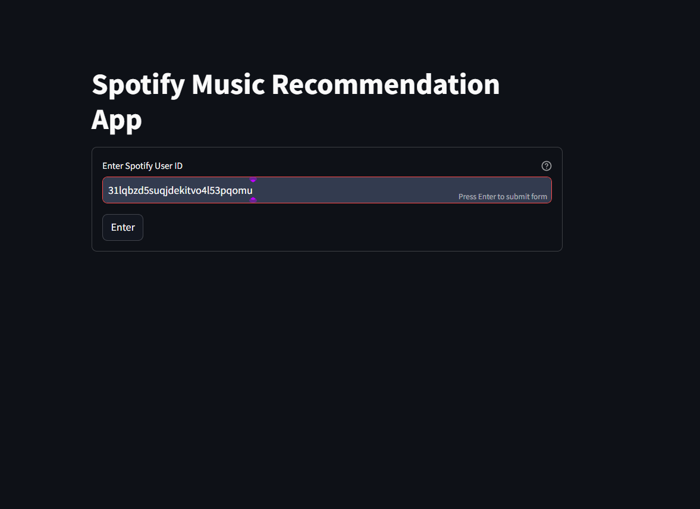
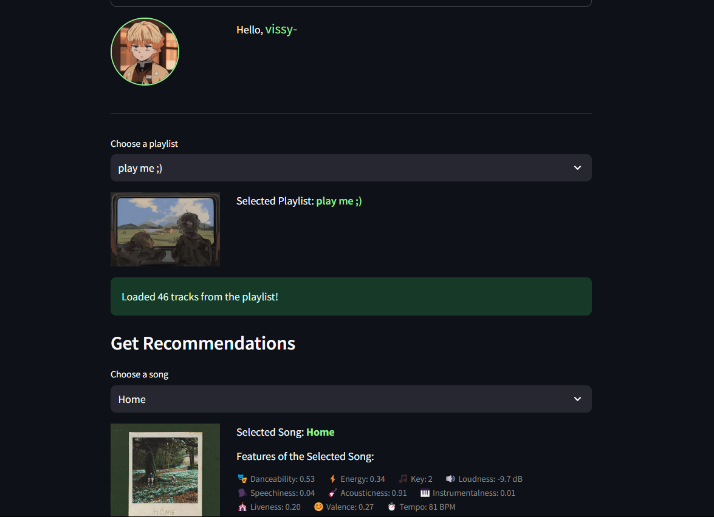
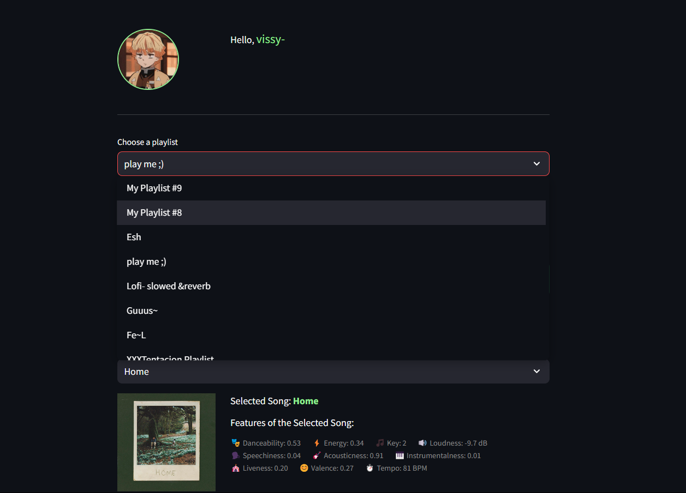
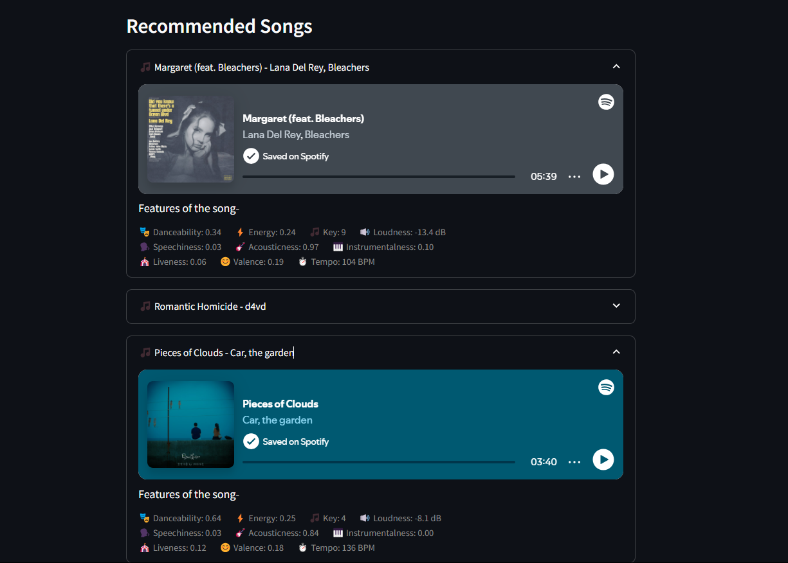

# 🎵 Music Recommendation Based on Music Features.

A sophisticated music recommendation system built with Streamlit and the Spotify API that analyzes your playlists and suggests similar songs based on **audio features and popularity metrics.**

## 📑 Table of Contents

- [Overview](#overview)
- [Features](#features)
- [Technical Architecture](#technical-architecture)
- [Recommendation System](#recommendation-system)

# 📸 Screen Shots

|     |  |
| ---------------------------------------- | ----------------------------------------- |
|     |       |
|  |        |

## 🎯 Overview

This application provides personalized music recommendations by analyzing the audio features of songs in **your Spotify playlists**. It uses a hybrid recommendation system that combines content-based filtering with popularity metrics to suggest songs that match both the musical characteristics and current trends.

## ✨ Features

- User profile integration with Spotify
- Playlist visualization and selection
- Detailed audio feature analysis for each track
- Interactive song selection interface
- Hybrid recommendation system
- Spotify embedded players for recommended tracks
- Real-time audio feature comparison
- Responsive design with profile images and playlist covers

## 🏗 Technical Architecture

The application is built using:

- Streamlit for the user interface
- Python with Spotify Web API
- Pandas and NumPy for feature analysis
- Spotify Client Credentials Flow
- Used **audio Features and Popularity metrics** for Recommendation logic

## 🎼 Recommendation System

The recommendation engine uses a sophisticated hybrid approach:

### Content-Based Filtering

Analyzes the following audio features:

- Danceability
- Energy
- Key
- Loudness
- Mode
- Speechiness
- Acousticness
- Instrumentalness
- Liveness
- Valence
- Tempo

### Recommendation Algorithm

1. **Feature Extraction**

   - Extracts audio features for each track using Spotify's API
   - Normalizes features using MinMaxScaler for fair comparison

2. **Similarity Calculation**

   ```python
   similarity_scores = np.dot(input_features, music_features_scaled.T) / (
       np.linalg.norm(input_features) * np.linalg.norm(music_features_scaled, axis=1)
   )
   ```

3. **Popularity Weighting**

   - Incorporates track popularity
   - Applies time-based weighting to favor newer releases

   ```python
   weighted_popularity = popularity * (1 / (days_since_release + 1))
   ```

4. **Hybrid Ranking**
   - Combines similarity scores with weighted popularity
   - Ranks recommendations based on the combined score
   - Returns top N recommendations

## 🔄 Data Flow

1. Entering UserID and playlist retrieval
2. Audio feature extraction for selected playlist
3. Feature normalization and similarity computation
4. Hybrid recommendation generation
5. Real-time visualization of results

The system ensures efficient processing by:

- Caching API responses in session state
- Processing track data in chunks (API limits)
- Implementing error handling for API requests
- Managing memory usage for large playlists
